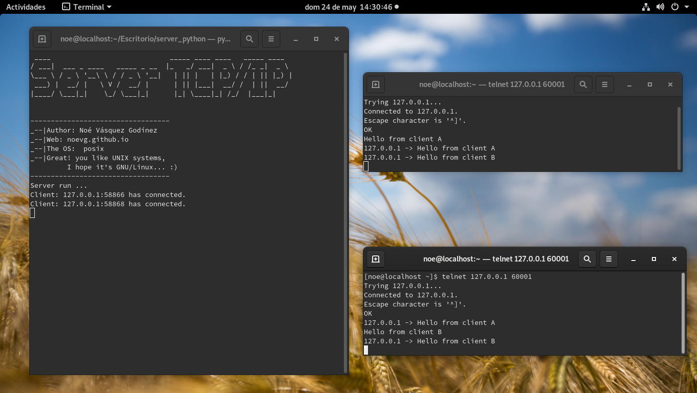

# Server TCP with python

```
 ____                             _____ ____ ____   _____ ____  
/ ___|  ___ _ ____   _____ _ __  |_   _/ ___|  _ \ / /_ _|  _ \
\___ \ / _ \ '__\ \ / / _ \ '__|   | || |   | |_) / / | || |_) |
 ___) |  __/ |   \ V /  __/ |      | || |___|  __/ /  | ||  __/
|____/ \___|_|    \_/ \___|_|      |_| \____|_| /_/  |___|_|    


----------------------------------
_--|Author: Noé Vásquez Godínez
_--|Web: noevg.github.io
_--|The OS:  posix
_--|Great! you like UNIX systems,
  I hope it's GNU/Linux... :)
----------------------------------

```
This code implement server TCP with python, attend various clients
with python threading.

## Required packages:
```
python3 -m pip install pyfiglet

```
## Run :
```
python3 server.py
```

## Screenshot:
<center>
 
</center>
